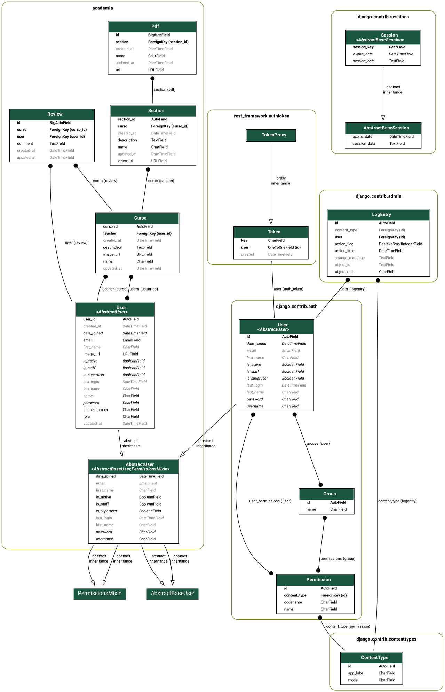
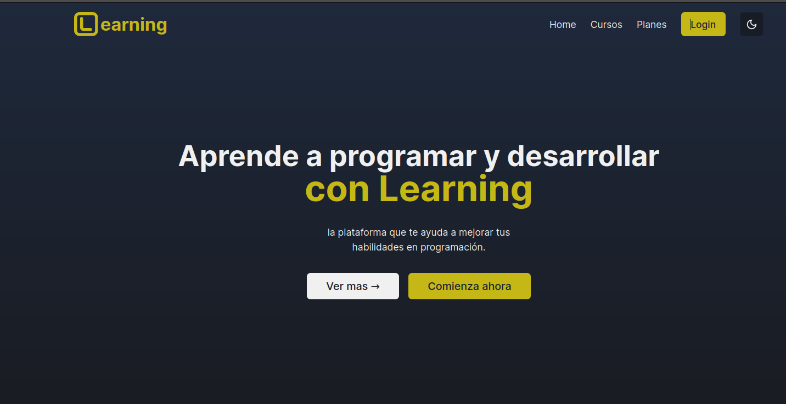
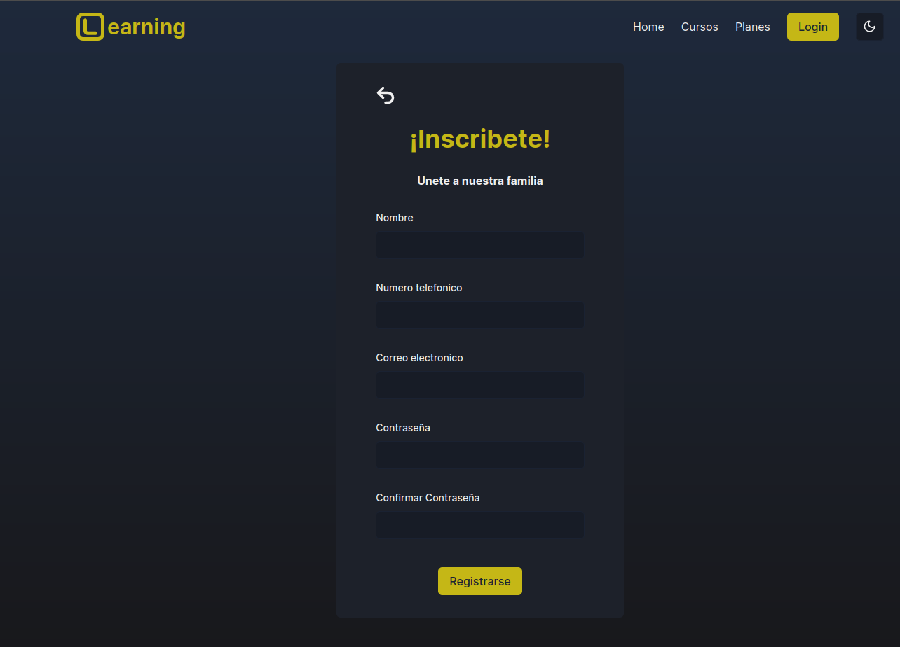
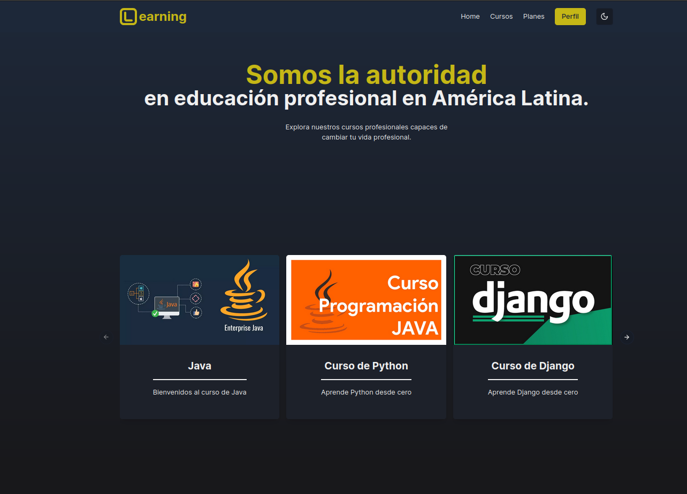
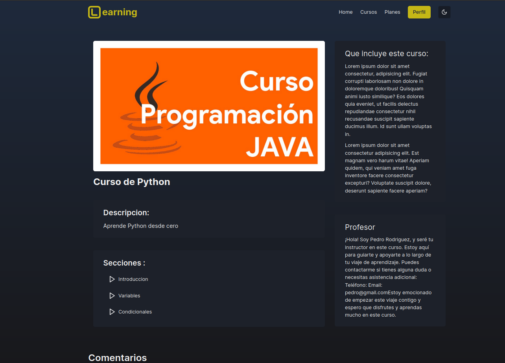
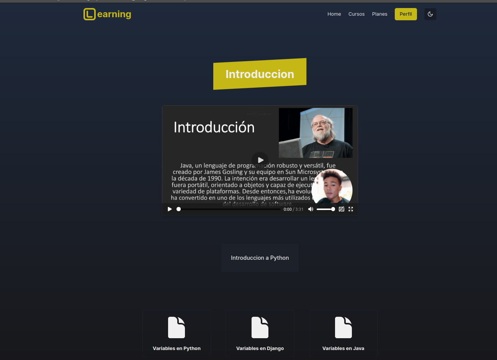
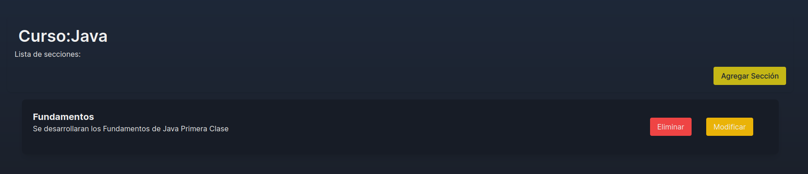
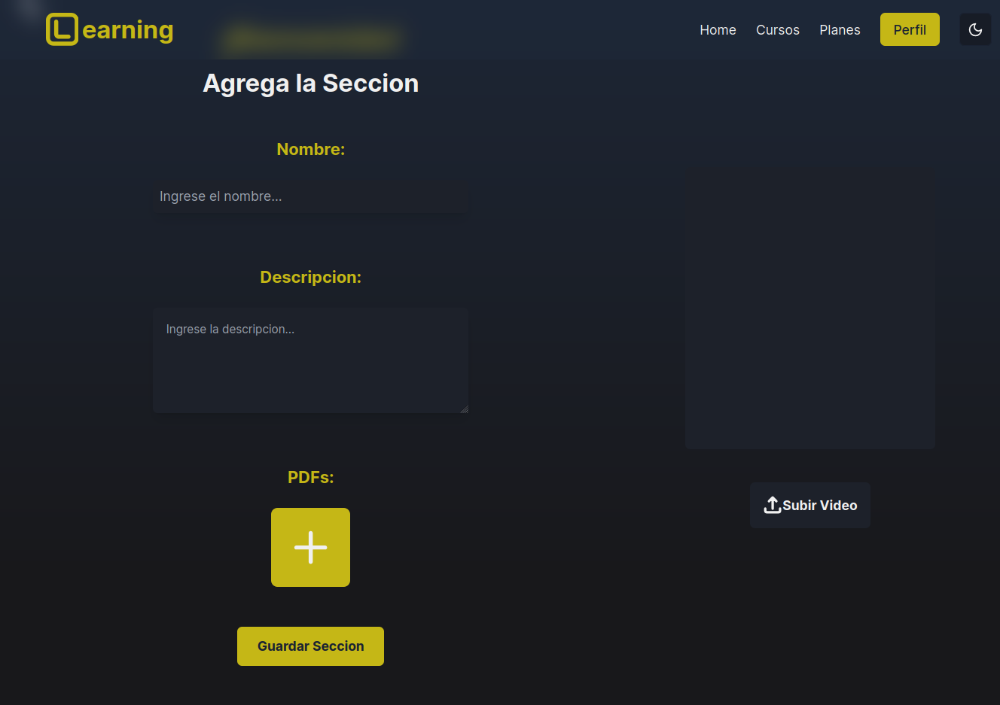
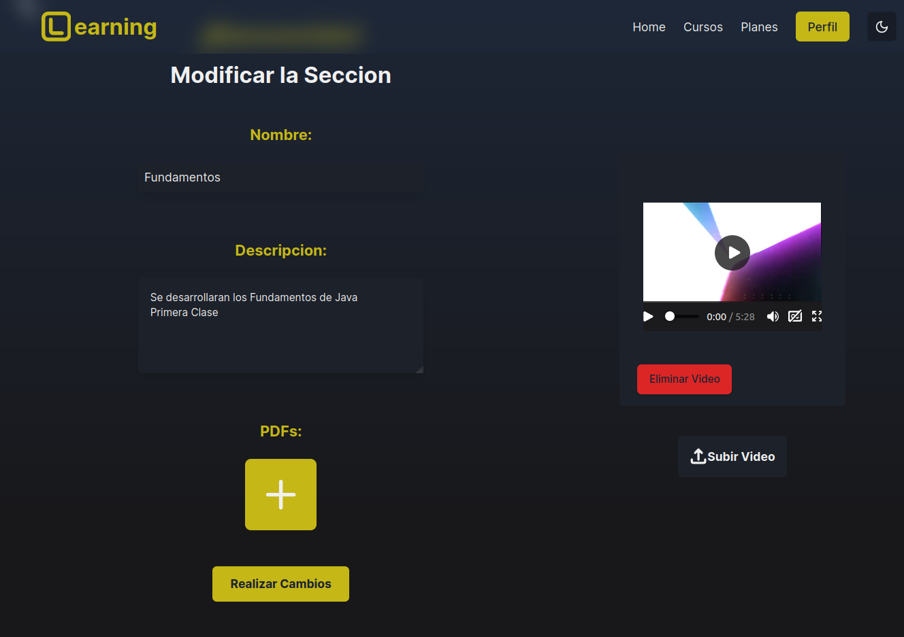

<table>
    <theader>
        <tr>
            <td></td>
            <th>
                UNIVERSIDAD NACIONAL DE SAN AGUSTIN 
                FACULTAD DE INGENIERÍA DE PRODUCCIÓN Y SERVICIOS 
                DEPARTAMENTO ACADÉMICO DE INGENIERÍA DE SISTEMAS E INFORMÁTICA 
                ESCUELA PROFESIONAL DE INGENIERÍA DE SISTEMAS
            </th>
            <td></td>
        </tr>
    </theader>
</table>

  <table>
   
    <tbody>
      <tr><td>ASIGNATURA:</td><td colspan="5">Programacion Web 2</td></tr>
      <tr><td>TÍTULO:</td><td colspan="5">Proyecto Final</td></tr>
      <tr><td>PROYECTO:</td><td colspan="5">Academia Learning</td></tr>
      <tr>
      <td>FECHA DE PRESENTACION:</td><td>27-Julio-2024</td><td>AÑO LECTIVO:</td><td>2024 A</td><td>NRO. SEMESTRE:</td><td>III</td>
      </tr>
      <tr><td colspan="6">DOCENTES:
          <ul>
            <li>Richart Smith Escobedo Quispe - rescobedoq@unsa.edu.pe</li>
            <li>Marcela Quispe Cruz - mquispecr@unsa.edu.pe</li>
          </ul>
      </td></<tr>
      <tr><td colspan="6">AUTORES:
          <ul>
            <li>Armando Steven Cuno Cahuari - acunoc@unsa.edu.pe</li>
            <li>Victor Narciso Mamani Anahua - vmamanian@unsa.edu.pe</li>
            <li>Jorge Luis Mamani Huarsaya - jmamanihuars@unsa.edu.pe</li>
            <li>Yenaro Joel Noa Camino - ynoa@unsa.edu.pe</li>
          </ul>
      </td></<tr>
    </tdbody>
  </table>

# ACADEMIA DE ESTUDIOS LEARNING - TECNOLOGIAS USADAS

[![Django][Django]][django-site]
[![DjangoREST][DjangoREST]][DjangoREST-site]
[![React][React]][react-site]
[![Tailwind][Tailwind]][tailwind-site]
[![MUI][MUI]][mui-site]
[![Git][Git]][git-site]
[![GitHub][GitHub]][github-site]
[![NextJS][NextJS]][NextJS-site]

# Marco de Trabajo (Backend - Frontend)

# Backend - Proyecto PWEB

En esta sección, explicaremos detalladamente la implementación del backend para el proyecto.

## Diagrama de Flujo:

  

*Figura 1\. Modelado de las tablas de la DB*

## Descripción General

El backend del proyecto está construido utilizando Django, un framework de alto nivel para el desarrollo de aplicaciones web en Python.

## Flujo de Trabajo

1. El usuario enviará una solicitud HTTP al servidor.
2. La solicitud se enrutará a través de los archivos `urls.py` al controlador adecuado en el módulo de vistas.
3. El controlador maneja la lógica de la solicitud, interactúa con los modelos de datos y utiliza los serializadores si es necesario.
4. La respuesta es devuelta al usuario en formato JSON a través de la API RESTful.

Explicaremos la composición de cada módulo en nuestro proyecto para ilustrar el flujo de trabajo de Django utilizado para el backend.

### Módulo Academia

La creación de nuestra aplicación dentro del proyecto backend es fundamental ya que cumple roles esenciales. Cada aplicación en Django actúa como un componente independiente que gestiona una parte específica de la funcionalidad del proyecto.

- **Models**: Definiremos varios modelos en Django para el proyecto relacionado con cursos, usuarios, reseñas, PDFs, entre otros. Cada modelo utilizará diferentes tipos de campos para su representación en la base de datos. Estableceremos relaciones entre estos modelos utilizando `ManyToManyField` y `ForeignKey` según sea necesario para capturar las interacciones y la estructura de datos requerida por la aplicación. Tendremos diversas relaciones entre los modelos:
  - Curso a Teacher
  - Review a Teacher

- **Views**: Definiremos vistas en Django para gestionar las solicitudes de la API RESTful. Utilizaremos vistas basadas en clases proporcionadas por Django REST Framework (DRF) para operaciones CRUD estándar. Implementaremos vistas personalizadas para acciones específicas que puedan requerir lógica adicional o filtros particulares para la presentación de los datos.

### Módulo Users

En este módulo, gestionaremos toda la lógica relacionada con la autenticación de usuarios, incluyendo inicio de sesión, registro, cierre de sesión y manejo de contraseñas.

- **Models**: Definiremos el modelo `User` que extiende el `AbstractUser` de Django para añadir campos adicionales según los requisitos del proyecto.
- **Views**: Crearemos vistas para manejar la lógica de registro, inicio de sesión y gestión de perfil de usuario. Utilizaremos vistas basadas en clases y funciones según convenga para las distintas funcionalidades.

### Otros Módulos

También podemos tener otros módulos en la aplicación Django, tales como `Payments` para gestionar pagos, `Notifications` para manejar notificaciones, etc. Cada uno de estos módulos tendrá su propia estructura similar, con modelos, vistas y URLS definidos de manera clara y modular.

## Base de Datos

La base de datos utilizada en el proyecto será PostgreSQL, un sistema de gestión de bases de datos relacional avanzado y robusto que permite gestionar datos de manera eficiente y segura. Django proporciona una integración fácil con PostgreSQL, facilitando la configuración y el manejo de la base de datos.

## Serializers

Utilizaremos serializadores proporcionados por Django REST Framework (DRF) para convertir instancias de modelos Django en representaciones JSON. Los serializadores también validarán los datos entrantes para asegurarse de que cumplen con las restricciones de los modelos antes de guardarlos en la base de datos.

# Frontend - Proyecto PWEB

En esta sección, detallaremos la implementación del frontend utilizando React y otras tecnologías.

## Descripción General

El frontend del proyecto está construido utilizando React, una biblioteca de JavaScript para la construcción de interfaces de usuario. Además, utilizamos Next.js para el enrutamiento del lado del servidor y Tailwind CSS para el estilizado.

## Flujo de Trabajo

1. El usuario interactúa con la interfaz de usuario.
2. Las acciones del usuario disparan eventos en React, los cuales manejan la lógica del cliente.
3. React se comunica con el backend a través de llamadas a la API RESTful para obtener o enviar datos.
4. Los datos recibidos del backend se utilizan para actualizar el estado de los componentes de React, lo que a su vez actualiza la interfaz de usuario.

### Estructura de Componentes

Nuestra aplicación React estará estructurada en componentes reutilizables y modulares. A continuación, se detallan algunos de los componentes principales que forman parte del proyecto:

- **Header**: El encabezado de la aplicación, que incluye navegación y enlaces a las principales secciones del sitio.
- **Footer**: El pie de página, que contiene información de contacto, enlaces adicionales y derechos de autor.
- **CourseList**: Un componente que muestra una lista de cursos disponibles en la plataforma.
- **CourseDetail**: Un componente para mostrar los detalles de un curso seleccionado.
- **UserProfile**: Un componente que gestiona y muestra la información del perfil del usuario.
- **Review**: Un componente que permite a los usuarios escribir y ver reseñas de los cursos.

### Estilizado

Utilizamos Tailwind CSS para estilizar la aplicación. Tailwind CSS es un framework de CSS que proporciona utilidades predefinidas para la creación de interfaces de usuario. Nos permite aplicar clases directamente en los elementos HTML para agregar estilos de manera rápida y eficiente.

### Gestión del Estado

Utilizamos el hook `useState` para manejar el estado local de los componentes y `useEffect` para manejar efectos secundarios, como la obtención de datos desde el backend. Para la gestión de estado más compleja y compartida entre múltiples componentes, podemos utilizar Context API o bibliotecas de terceros como Redux.

### Manejo de Rutas

Next.js facilita el manejo de rutas en la aplicación. Creamos archivos dentro de la carpeta `pages` y Next.js automáticamente los trata como rutas. Esto permite un enrutamiento sencillo del lado del cliente y del servidor.

## Integración con Backend

La integración con el backend se realiza a través de llamadas HTTP a la API RESTful proporcionada por el backend de Django. Utilizamos la biblioteca Axios para hacer estas solicitudes de manera eficiente.

## Despliegue

El frontend se desplegará utilizando servicios como Vercel, que proporciona una integración perfecta con Next.js para un despliegue rápido y sencillo.

### Home

  

*Figura 2\. Home - Academia Learning*

### Register

  

*Figura 3\. Register - Academia Learning*

### Cursos

  

*Figura 4\. Cursos - Academia Learning*

### Secciones

  

*Figura 5\. Secciones - Academia Learning*

### Seccion

  

*Figura 6\. Seccion del Curso - Academia Learning*

### Secciones CRUD - Add - Edit - Delete 

  <h4>CRUD Secciones</h4>
  

*Figura 7\. CRUD Seccion - Academia Learning*
  <h4>Agregar Seccion</h4>
  
  
*Figura 8\. Agregar Seccion - Academia Learning*
  <h4>Editar Seccion</h4>
  

*Figura 9\. Editar Seccion - Academia Learning*
  <h4>Eliminar Seccion</h4>
  

*Figura 10\. Eliminar Seccion - Academia Learning*

### Conclusiones

El desarrollo del proyecto Academia Learning ha sido una experiencia integral que ha permitido aplicar y coordinar diversas tecnologías en el desarrollo web. En el backend, Django y Django REST Framework han facilitado la creación de una API robusta y segura, simplificando la gestión de datos y la implementación de la lógica de negocio. En el frontend, React y Next.js han permitido construir una interfaz de usuario dinámica y eficiente, optimizando el rendimiento y la mantenibilidad del código. Tailwind CSS ha agilizado el proceso de estilizado con su enfoque de clases de utilidad predefinidas. La integración de estas tecnologías, apoyada por PostgreSQL para la gestión de bases de datos, ha garantizado un sistema modular y bien estructurado. Este proyecto ha permitido aplicar conocimientos avanzados de programación web, desarrollando competencias en diseño, implementación y despliegue de aplicaciones web completas

## Referencias

1. React. (2023). *Getting Started – React*. [En línea]. Disponible en: https://reactjs.org/docs/getting-started.html.
2. Next.js. (2023). *Next.js Documentation*. [En línea]. Disponible en: https://nextjs.org/docs.
3. Tailwind CSS. (2023). *Tailwind CSS Documentation*. [En línea]. Disponible en: https://tailwindcss.com/docs.
4. Cloudinary. (2023). *Cloudinary Documentation*. [En línea]. Disponible en: https://cloudinary.com/documentation.
5. Django. (2023). *Django Documentation*. [En línea]. Disponible en: https://docs.djangoproject.com/en/stable/.
6. Django Rest Framework. (2023). *Django Rest Framework Documentation*. [En línea]. Disponible en: https://www.django-rest-framework.org/.

[Git]: https://img.shields.io/badge/git-%23F05033.svg?style=for-the-badge&logo=git&logoColor=white
[git-site]: https://git-scm.com/

[GitHub]: https://img.shields.io/badge/github-%23121011.svg?style=for-the-badge&logo=github&logoColor=white
[github-site]: https://github.com/

[Django]: https://img.shields.io/badge/Django-092E20?style=for-the-badge&logo=django&logoColor=white
[django-site]: https://www.djangoproject.com/

[React]: https://img.shields.io/badge/React-20232A?style=for-the-badge&logo=react&logoColor=61DAFB
[react-site]: https://reactjs.org/

[Tailwind]: https://img.shields.io/badge/Tailwind_CSS-38B2AC?style=for-the-badge&logo=tailwind-css&logoColor=white
[tailwind-site]: https://tailwindcss.com/

[MUI]: https://img.shields.io/badge/Material--UI-0081CB?style=for-the-badge&logo=material-ui&logoColor=white
[mui-site]: https://mui.com/

[Node.js]: https://img.shields.io/badge/Node.js-339933?style=for-the-badge&logo=node.js&logoColor=white
[nodejs-site]: https://nodejs.org/

[Git]: https://img.shields.io/badge/Git-F05032?style=for-the-badge&logo=git&logoColor=white
[git-site]: https://git-scm.com/

[GitHub]: https://img.shields.io/badge/GitHub-181717?style=for-the-badge&logo=github&logoColor=white
[github-site]: https://github.com/

[DjangoREST]: https://img.shields.io/badge/DJANGO-REST-ff1709?style=for-the-badge&logo=django&logoColor=white&color=ff1709&labelColor=gray
[DjangoREST-site]: https://www.django-rest-framework.org/

[NextJS]: https://img.shields.io/badge/Next-black?style=for-the-badge&logo=next.js&logoColor=white
[NextJS-site]: https://nextjs.org/